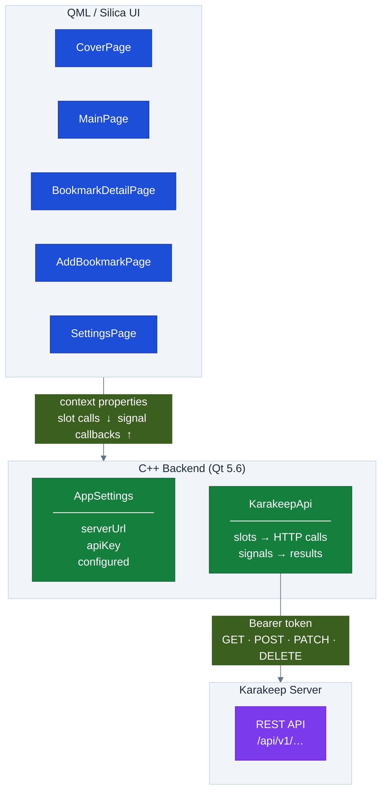
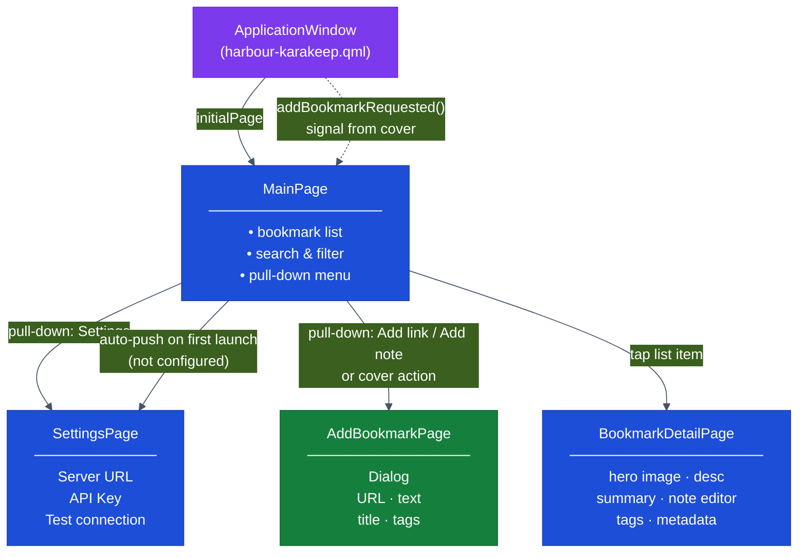

# Architecture

## Application layers

KaraKeep follows the standard SailfishOS pattern: a C++ backend compiled into the application binary, registered as named context properties, and consumed by a QML/Silica UI.



### Context properties

`src/harbour-karakeep.cpp` registers two singletons before the QML engine starts:

| Property name | C++ type | Responsibility |
|---|---|---|
| `AppSettings` | `AppSettings*` | Persists `serverUrl` and `apiKey` via `QSettings`; exposes `configured` (bool) |
| `KarakeepApi` | `KarakeepApi*` | All network I/O; async slots invoked from QML, results delivered as signals |

### Async contract

Every `KarakeepApi` operation follows the same pattern:

1. QML calls a **slot** (e.g. `KarakeepApi.fetchBookmarks(…)`)
2. C++ starts an async `QNetworkReply` and increments an internal `m_pending` counter
3. The reply's `finished` lambda fires on the Qt event loop:
   - On success → emits a typed **success signal** (e.g. `bookmarksFetched(bookmarks, nextCursor)`)
   - On error → emits the uniform **error signal**: `requestError(operation, httpStatus, message)`
4. QML pages connect to signals via `Connections { target: KarakeepApi }` and update their local `ListModel` or page state

`httpStatus == 0` means a network-level failure with no HTTP response.

### Data types and the C++/QML boundary

All API response types are plain structs in `src/api/karakeeptypes.h`:

```
Bookmark        BookmarkTag      Tag
BookmarkList    KarakeepUser
```

Each struct has two static methods:

| Method | Direction | Used for |
|--------|-----------|----------|
| `fromJson(QJsonObject)` | JSON → struct | Parsing API responses |
| `toVariantMap()` | struct → `QVariantMap` | Crossing the C++/QML boundary via signals |

QML only ever receives `QVariantMap` / `QVariantList` — never typed C++ objects. This avoids the need to register metatypes and keeps QML property access simple.

`parseIsoDateTime()` (also in `karakeeptypes.h`) is a Qt 5.6 workaround: Qt 5.6 cannot parse ISO 8601 timestamps that include milliseconds or timezone offsets.

---

## Page navigation



`ApplicationWindow` holds shared state and signals used by both `MainPage` and `CoverPage`:
- `totalBookmarkCount` — updated by `MainPage` after each fetch (all-bookmarks filter only)
- `lastBookmarkTitle` — title of the most recently fetched first bookmark
- `addBookmarkRequested()` — signal fired by the cover page action; `MainPage` listens and pushes `AddBookmarkPage`

---

## Shared backend: `karakeep_backend.pri`

Both the main app and the integration test harness include `karakeep_backend.pri`, which adds `src/api/appsettings.*`, `src/api/karakeepapi.*`, `src/api/karakeeptypes.h`, and `QT += network`. To add a new API class, add it to this `.pri` file so the test suite picks it up automatically.

---

## Qt 5.6 compatibility notes

| Issue | Safe pattern |
|-------|-------------|
| No `String.endsWith()` in V4 JS engine | `str.charAt(str.length - 1) === "/"` |
| ISO 8601 timestamps with ms / timezone fail `Qt::ISODate` | Use `parseIsoDateTime()` from `karakeeptypes.h` |
| `QVariant(void*)` constructor deleted | Never pass `QQuickItem*` to `setContextProperty()` |
| `sendCustomRequest` requires `QIODevice*`, not `QByteArray` | Use `sendWithBody()` in `karakeepapi.cpp` |
| QNAM silently hangs on reused connections the server has closed | `req.setRawHeader("Connection", "close")` on every request |
