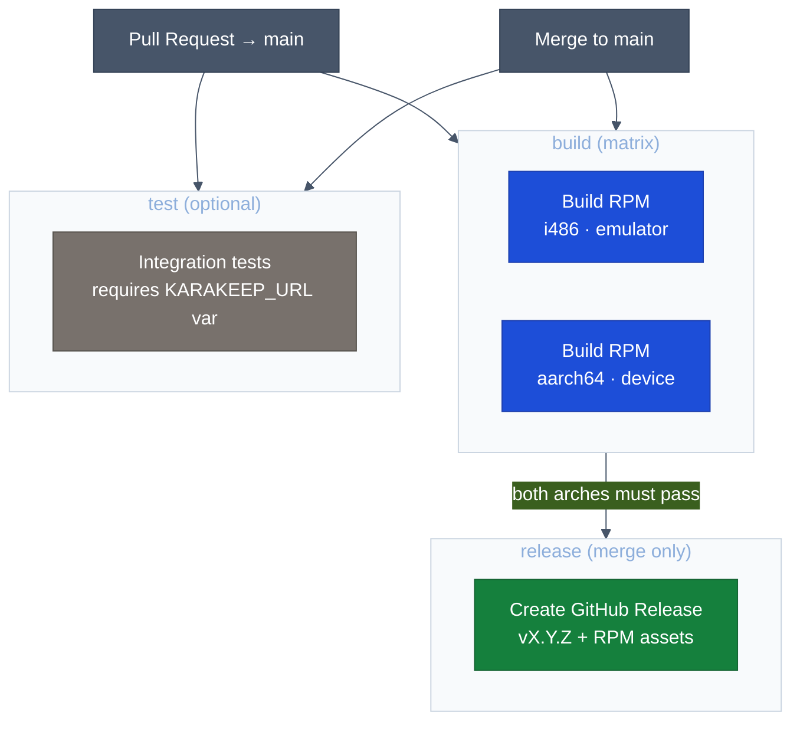

# CI/CD Pipeline

## Overview

The pipeline has two distinct trigger paths with different outcomes:



## Jobs

### `build` — runs on every push and every PR

Compiles the app for both `i486` (emulator) and `aarch64` (device) using `mb2` inside the pre-built SailfishOS SDK container.

Key details:
- Source is mounted at `/home/mersdk/build` (not `/build`) so that `sb2` path mappings are satisfied
- `chmod -R a+rw` is applied before `docker run` because the runner-owned workspace must be writable by the `mersdk` user inside the container
- Produced RPMs are uploaded as workflow artifacts named `harbour-karakeep-{target}-rpm` (retention: 14 days)

### `test` — conditional, runs when `vars.KARAKEEP_URL` is set

Builds a host-native test binary (`tst_karakeepapi`) using the same backend sources and runs integration tests against a live Karakeep server.

Required repository configuration:

| Setting | Where | Value |
|---------|-------|-------|
| `KARAKEEP_URL` | Repository variable | Server URL, e.g. `https://karakeep.example.com` |
| `KARAKEEP_API_KEY` | Repository secret | A full-access API key |

Tests create and delete bookmarks tagged `__sailfish_test__` and clean up after themselves.

### `release` — runs only on push to `main` (never on PRs)

Depends on `build` completing successfully for both architectures.

Steps:
1. Reads `Version:` from `rpm/harbour-karakeep.spec` — must match `X.Y.Z` (semver) or the job fails
2. Extracts the first `## [X.Y.Z]` section from `CHANGELOG.md` as release notes
3. Downloads both RPM artifacts from the `build` job
4. Creates a GitHub Release tagged `vX.Y.Z` with both RPMs attached

If the tag already exists (i.e. the version was not bumped before merging), the job fails — enforcing an explicit version bump for every release.

## Build environment

The build container `ghcr.io/juergenbr/karakeep-build-env:latest` is hosted on GHCR and contains:
- The SailfishOS SDK build engine (32-bit i486 base image)
- SailfishOS 5.0.0.62 tooling
- SailfishOS 5.0.0.62 target for `i486`
- SailfishOS 5.0.0.62 target for `aarch64`

The image is created via `docker run` → `sdk-manage` → `docker commit` (not `docker build`) because `sdk-manage target install` requires PAM/sudo, which is unavailable in `RUN` steps. Full reproduction instructions are in [`Dockerfile`](../Dockerfile).

To update the SFOS version: redo the commit procedure from the `Dockerfile`, push a new tagged image, and update `SFOS_VERSION` in `.github/workflows/build.yml`.

## Versioning

Versions follow [Semantic Versioning](https://semver.org). The version is the single source of truth in `rpm/harbour-karakeep.spec`:

```
Version:    X.Y.Z
```

When bumping a version, update these files together:

| File | What to change |
|------|----------------|
| `rpm/harbour-karakeep.spec` | `Version: X.Y.Z` |
| `qml/pages/SettingsPage.qml` | `DetailItem { value: "X.Y.Z" }` in the About section |
| `CHANGELOG.md` | Add a new `## [X.Y.Z] — YYYY-MM-DD` section at the top |
| `rpm/harbour-karakeep.changes` | Add a new entry at the top |
