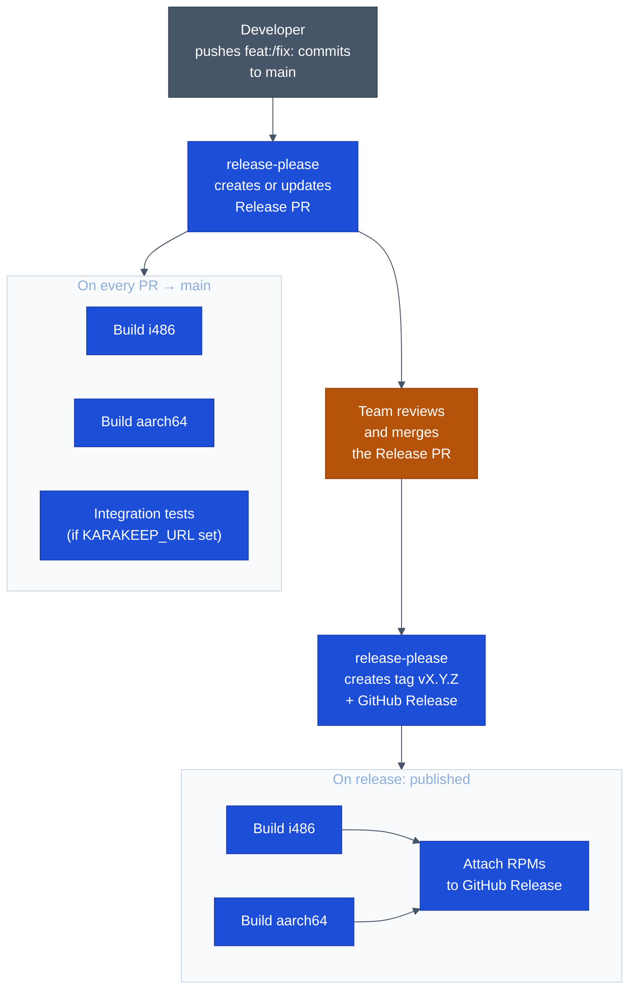

# CI/CD Pipeline

## Commit message convention

All commits must follow [Conventional Commits](https://www.conventionalcommits.org/). The type determines the semver bump applied to the next release:

| Commit type | Example | Semver bump |
|-------------|---------|-------------|
| `fix:` | `fix: search field dismissed on keystroke` | **patch** — 0.2.0 → 0.2.1 |
| `feat:` | `feat: add lists view` | **minor** — 0.2.0 → 0.3.0 |
| `feat!:` or `BREAKING CHANGE:` footer | `feat!: replace settings storage format` | **major** — 0.2.0 → 1.0.0 |
| `chore:`, `ci:`, `test:`, `style:` | — | none (hidden in changelog) |
| `docs:`, `refactor:`, `perf:` | — | none (shown in changelog, no version bump on their own) |

Commits that don't affect user-visible behaviour (`chore:`, `ci:`, `test:`, `style:`) are hidden from the changelog. Use them for infrastructure, formatting, and maintenance work.

---

## Workflow overview

---

## Jobs

### `release-please` (`.github/workflows/release-please.yml`)

Runs on every push to `main`. Reads conventional commit messages since the last release tag and:
- Creates (or updates) a **Release PR** titled `chore(main): release X.Y.Z`
- The PR automatically bumps `Version:` in `rpm/harbour-karakeep.spec` and `value:` in `qml/pages/SettingsPage.qml`
- Updates `CHANGELOG.md` with grouped entries (`### Added`, `### Fixed`, etc.)
- Updates `.release-please-manifest.json` with the new version

When the Release PR is merged, release-please creates the git tag `vX.Y.Z` and a GitHub Release (no RPMs yet — the build job attaches them).

### `build` (`.github/workflows/build.yml`)

Compiles for `i486` (emulator) and `aarch64` (device).

Triggers:
- **`pull_request → main`** — validates every PR including release-please's Release PR
- **`release: published`** — builds the exact tagged commit and makes artifacts available for `attach-rpms`

### `test` (`.github/workflows/build.yml`)

Integration tests against a live server. Only runs on `pull_request` events (not on releases). Skipped unless `vars.KARAKEEP_URL` is configured.

| Setting | Where | Value |
|---------|-------|-------|
| `KARAKEEP_URL` | Repository variable | Server URL |
| `KARAKEEP_API_KEY` | Repository secret | Full-access API key |

### `attach-rpms` (`.github/workflows/build.yml`)

Runs after both `build` matrix jobs succeed, only on `release: published`. Downloads both RPM artifacts and uploads them to the GitHub Release.

---

## Day-to-day release process

1. Commit and push feature/fix work to `main` using conventional commit messages.
2. release-please opens or updates a Release PR automatically.
3. When ready to ship, review the Release PR (check the version bump and changelog), then merge it.
4. release-please creates the tag and release; the build workflow attaches RPMs within minutes.

No manual version edits, tag pushes, or changelog entries needed.

---

## Build environment

The build container `ghcr.io/juergenbr/karakeep-build-env:latest` is hosted on GHCR and contains:
- The SailfishOS SDK build engine (32-bit i486 base image)
- SailfishOS 5.0.0.62 tooling
- SailfishOS 5.0.0.62 target for `i486`
- SailfishOS 5.0.0.62 target for `aarch64`

The image is created via `docker run` → `sdk-manage` → `docker commit` (not `docker build`) because `sdk-manage target install` requires PAM/sudo, which is unavailable in `RUN` steps. Full reproduction instructions are in [`Dockerfile`](../Dockerfile).

To upgrade the SFOS version: redo the commit procedure from the `Dockerfile`, push a new tagged image, and update `SFOS_VERSION` in `.github/workflows/build.yml`.
